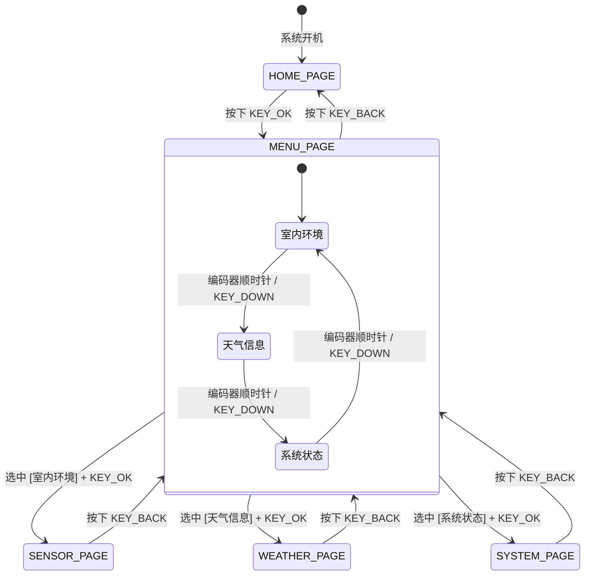

# ESP32-S3 SmartDesk (智能桌面多功能小终端) 🖥️

基于 **ESP32-S3** 开发的桌面智能交互终端项目。集成了 **SHT30 高精度环境温湿度采集**、**WiFi 自动联网**、**聚合数据实时天气查询**、**NTP 网络原子钟授时**、**中文字符多级菜单系统** 以及 **双模交互（按键 + 旋转编码器）**。

---

## ✨ 核心特性

- **🌡️ 高精度环境温湿度监测**：通过 I2C 总线挂载 SHT30 传感器（地址 `0x44`），每 2 秒定期采集并刷新当前室内温度与湿度。
- **🌦️ WiFi 自动联网与实时天气**：
  - 具备 WiFi 自动连接与掉线重连机制；
  - 结合 `HTTPClient` 与 `ArduinoJson` 高性能解析聚合天气 RESTful API，获取实时天气现象、室外温度与湿度。
- **⏰ NTP 网络高精度授时**：开机联网后自动同步 NTP 时间服务器（东八区 UTC+8），精准计算并格式化显示年月日、时分秒。
- **📋 模块化多级菜单与页面状态机**：
  - 基于 `U8g2` 驱动 128×64 SSD1306 OLED 屏幕，内嵌点阵中文字库；
  - 包含 **主页 (Home)**、**主菜单 (Menu)**、**室内环境 (Sensor)**、**天气详情 (Weather)**、**系统状态 (System)** 5 大页面。
  - 系统页面支持查看 ESP32 芯片型号、当前可用 RAM（Free Heap）及开机运行时间（$hh:mm:ss$）。
- **🎛️ 双模交互输入系统 (按键 + 旋转编码器)**：
  - **4 按键支持**：上翻 (UP)、下翻 (DOWN)、确认 (OK)、返回 (BACK)；
  - **EC11 旋转编码器支持**：内置 16 状态正交编码状态机，支持顺逆时针无级旋钮平滑翻页与导航。
- **⚙️ 集中化参数配置 (`src/config.h`)**：引脚定义、WiFi 凭据、API 密钥、授时服务器统一管理，结构清晰。

---

## 🛠️ 硬件与引脚分配 (Pinout)

### 1. I2C 总线（OLED 屏幕 & SHT30 传感器共用）
| 设备 | ESP32-S3 引脚 | 说明 |
| :--- | :--- | :--- |
| **SDA** | `GPIO 5` | I2C 数据线（默认上拉） |
| **SCL** | `GPIO 4` | I2C 时钟线 |
| **VCC / GND** | `3V3 / GND` | 模块供电（3.3V） |

### 2. 交互输入引脚
| 功能 | ESP32-S3 引脚 | 类型 | 说明 |
| :--- | :--- | :--- | :--- |
| **KEY_UP** | `GPIO 9` | 内部上拉输入 | 向上翻页 / 菜单前一项 |
| **KEY_DOWN** | `GPIO 10` | 内部上拉输入 | 向下翻页 / 菜单后一项 |
| **KEY_OK** | `GPIO 11` | 内部上拉输入 | 确认进入菜单 / 子页面 |
| **KEY_BACK** | `GPIO 12` | 内部上拉输入 | 返回上一级页面 |
| **ENC_A** | `GPIO 35` | 内部上拉输入 | 编码器 A 相 |
| **ENC_B** | `GPIO 36` | 内部上拉输入 | 编码器 B 相 |
| **ENC_SW** | `GPIO 37` | 内部上拉输入 | 编码器中键按压 |

---

## 🏗️ 页面状态机与流转逻辑



---

## 📁 目录结构

```text
SmartDesk/
├── .gitignore              # Git 忽略规则
├── platformio.ini          # PlatformIO 构建与库依赖配置
├── README.md               # 项目详细说明文档
├── LICENSE                 # MIT 开源协议
├── include/                # 头文件目录
└── src/
    ├── config.h            # 全局引脚、WiFi、天气 API 等集中配置
    ├── main.cpp            # 主循环任务调度与定时器轮询
    ├── system_state.h/.cpp # 全局状态单例 (SystemState)
    ├── display.h/.cpp      # U8g2 OLED 页面渲染与文字排版
    ├── page.h/.cpp         # 页面导航与状态机跳转控制
    ├── menu.h/.cpp         # 菜单条目与高亮游标渲染
    ├── input.h/.cpp        # 按键与 EC11 编码器消抖状态机
    ├── sensor.h/.cpp       # SHT30 驱动与数据采集
    ├── wifilink.h/.cpp     # WiFi 状态监测与自动连接
    ├── weather.h/.cpp      # 聚合数据天气 API 请求与 JSON 解析
    └── time_manager.h/.cpp # NTP 网络授时与时间格式化
```

---

## 🚀 快速上手 (Getting Started)

### 1. 配置个人凭据
在编译前，打开 [`src/config.h`](src/config.h) 修改你的 WiFi 与天气 API 配置：

```cpp
// 1. 设置 WiFi 账号密码
#define DEFAULT_WIFI_SSID "你的WiFi名称"
#define DEFAULT_WIFI_PASS "你的WiFi密码"

// 2. 设置天气城市与 API Key (可在聚合数据免费申请)
#define WEATHER_CITY      "北京"
#define WEATHER_API_KEY   "你的聚合数据API_KEY"
```

### 2. 编译与烧录
1. 使用 VS Code 打开 `SmartDesk` 目录；
2. 安装 PlatformIO 扩展；
3. 点击底部状态栏的 **Build (✓)** 编译，连接 ESP32-S3 开发板后点击 **Upload (→)** 烧录。

---

## 🔮 后续规划 (Roadmap)

- [ ] **FreeRTOS 多任务重构**：将传感器读取、天气 HTTP 请求与 UI 渲染迁移至 FreeRTOS 独立 Task。
- [ ] **WebServer 网页配网**：支持开机 AP 模式 Web 网页配置 WiFi 与城市，无需重新编译固件。
- [ ] **番茄钟 / 倒计时小工具**：增加专注时钟与蜂鸣器提醒。
- [ ] **PC 硬件监视器 (AIDA64 联动)**：通过串口或 BLE 接收电脑 CPU/GPU 温度与占用率并展示。

---

## 📄 开源协议

本项目采用 [MIT License](LICENSE) 开源。
