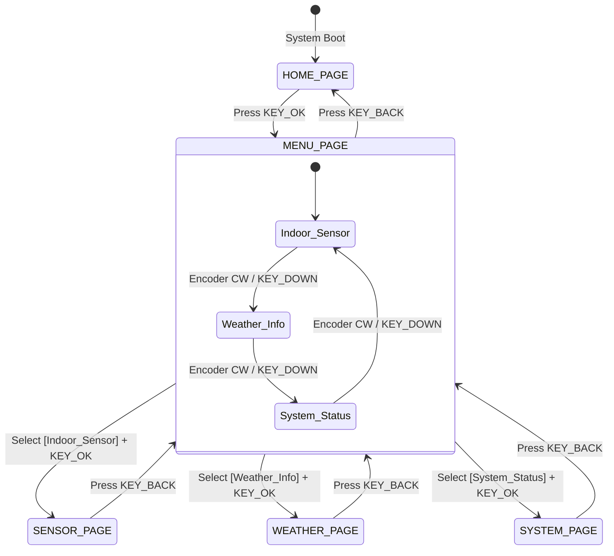

# ESP32-S3 SmartDesk (Multifunctional Smart Desktop Terminal) 🖥️

<p align="center">
  <a href="README_EN.md"></a>
  <a href="README.md"></a>
  <a href="https://www.espressif.com/en/products/socs/esp32-s3"></a>
  <a href="https://www.freertos.org/"></a>
  <a href="https://platformio.org/"></a>
  <a href="LICENSE"></a>
</p>

<p align="center">
  <b>⚡ A feature-rich ESP32-S3 smart desktop terminal featuring FreeRTOS dual-task architecture, OLED telemetry UI, environmental sensing & cloud dashboard.</b><br>
  <i>A highly-integrated desktop interactive terminal built on ESP32-S3: integrates high-precision temperature/humidity sensing, NTP network time sync, live weather queries, multi-level menu state machine, and a lightweight Python cloud dashboard.</i>
</p>

---

## 🌟 Key Features

- **🌡️ High-Precision Environmental Sensing**: Queries SHT30 sensor over I2C (address `0x44`) with low jitter to read and update ambient indoor temperature & humidity.
- **🌦️ WiFi Auto-Connectivity & Live Weather**:
  - Auto-connection with exponential backoff reconnect mechanism.
  - Combines `HTTPClient` and `ArduinoJson` to parse weather RESTful APIs, retrieving real-time weather conditions, outdoor temperature, and humidity.
- **⏰ NTP Precision Time Synchronization**: Synchronizes automatically with NTP servers upon network connection (UTC+8 or configurable timezone), formatting date, weekday, and time.
- **📋 Modular Multi-Level Menu & State Machine**:
  - Driven by `U8g2` on a 128×64 SSD1306 OLED display.
  - Features 5 main views: **Home**, **Menu**, **Sensor Details**, **Weather Details**, and **System Status**.
  - System status screen reports chip model, free heap memory, and runtime uptime ($hh:mm:ss$).
- **🎛️ Dual-Mode Input System (Buttons + Rotary Encoder)**:
  - **4-Button Navigation**: UP, DOWN, OK, and BACK.
  - **EC11 Quadrature Rotary Encoder**: Built-in 16-state quadrature state machine for smooth, stepless scroll navigation.
- **📊 Cloud Dashboard & Timeseries Telemetry (`server/smartdesk_server.py`)**:
  - Periodically transmits sensor data, weather info, and system health to a central server via HTTP POST.
  - Bundled with a **zero-dependency, lightweight** Python native Web dashboard featuring dark geek aesthetic, live trend charts, heartbeat monitoring, and SQLite timeseries persistence.
- **⚡ FreeRTOS Dual-Core Multitasking Architecture**:
  - **Core 0 (Networking & I/O)**: Handles WiFi reconnection, HTTP weather fetch, NTP synchronization, and telemetry dispatch without blocking UI rendering.
  - **Core 1 (UI & Interaction)**: Runs at 30~60 FPS handling debounce, EC11 rotary pulses, and OLED display rendering.
  - **Inter-Core Synchronization**: Safe state synchronization using FreeRTOS queues (`QueueHandle_t`) and mutexes.

---

## 🏗️ FreeRTOS Dual-Core Task Allocation Model

```text
┌────────────────────────────────────────────────────────┐
│                   ESP32-S3 Dual-Core Architecture      │
├────────────────────────────┬───────────────────────────┤
│    Core 0: Network & I/O   │     Core 1: UI & Render   │
│   (vTaskNetwork & Telemetry)│    (vTaskUI & Input Loop) │
├────────────────────────────┼───────────────────────────┤
│  • WiFi monitoring & recon │  • EC11 rotary encoder FSM│
│  • NTP time calibration    │  • Button debounce filter │
│  • Weather REST API polling│  • U8g2 menu/page render  │
│  • SQLite telemetry upload │  • Cursor animation loop  │
└─────────────┬──────────────┴─────────────▲─────────────┘
              │     FreeRTOS Message Queue │
              └───────── Queue / Mutex ────┘
```

---

## 🛠️ Hardware & Pinout

### 1. I2C Bus (Shared between OLED Display & SHT30 Sensor)
| Peripheral | ESP32-S3 Pin | Description |
| :--- | :--- | :--- |
| **SDA** | `GPIO 5` | I2C Data line (pull-up enabled) |
| **SCL** | `GPIO 4` | I2C Clock line |
| **VCC / GND** | `3V3 / GND` | Module power supply (3.3V) |

### 2. User Input Pins
| Function | ESP32-S3 Pin | Type | Description |
| :--- | :--- | :--- | :--- |
| **KEY_UP** | `GPIO 9` | Internal pull-up input | Navigate up / Previous item |
| **KEY_DOWN** | `GPIO 10` | Internal pull-up input | Navigate down / Next item |
| **KEY_OK** | `GPIO 11` | Internal pull-up input | Confirm / Enter sub-menu |
| **KEY_BACK** | `GPIO 12` | Internal pull-up input | Return to parent menu |
| **ENC_A** | `GPIO 35` | Internal pull-up input | Rotary Encoder Phase A |
| **ENC_B** | `GPIO 36` | Internal pull-up input | Rotary Encoder Phase B |
| **ENC_SW** | `GPIO 37` | Internal pull-up input | Rotary Encoder Push Button |

---

## 🏗️ Page State Machine & Navigation Flow



---

## 📁 Directory Structure

```text
SmartDesk/
├── .gitignore              # Git ignore rules
├── platformio.ini          # PlatformIO build & dependency configuration
├── README.md               # Detailed Chinese documentation
├── README_EN.md            # Detailed English documentation
├── LICENSE                 # MIT License
├── server/                 # Cloud dashboard backend (Pure Python lightweight service)
│   └── smartdesk_server.py # Standalone dashboard (SQLite + REST API + Web UI)
├── include/                # Header files
└── src/
    ├── config.h            # Centralized pins, WiFi, weather API, telemetry URLs
    ├── main.cpp            # Main scheduler loop & timer callbacks
    ├── system_state.h/.cpp # Global state singleton (SystemState)
    ├── uploader.h/.cpp     # ESP32 telemetry uploader (HTTPClient + JSON)
    ├── display.h/.cpp      # U8g2 OLED layout & font typesetting
    ├── page.h/.cpp         # Page state machine & navigation controller
    ├── menu.h/.cpp         # Menu items & animated cursor renderer
    ├── input.h/.cpp        # Button debounce & EC11 quadrature FSM
    ├── sensor.h/.cpp       # SHT30 I2C sensor driver & reading
    ├── wifilink.h/.cpp     # WiFi manager & auto-reconnection
    ├── weather.h/.cpp      # RESTful weather fetch & JSON parser
    └── time_manager.h/.cpp # NTP client & timezone formatter
```

---

## 🚀 Getting Started

### 1. Configure Credentials
Prior to compilation, edit [`src/config.h`](src/config.h) to configure your WiFi, weather API, and telemetry endpoints:

```cpp
// 1. Set WiFi Credentials
#define DEFAULT_WIFI_SSID "YOUR_WIFI_SSID"
#define DEFAULT_WIFI_PASS "YOUR_WIFI_PASSWORD"

// 2. Set Weather City & API Key
#define WEATHER_CITY      "Hengshui"
#define WEATHER_API_KEY   "YOUR_WEATHER_API_KEY"

// 3. Set Cloud Telemetry Server Endpoint (public IP/domain or local LAN IP)
#define SERVER_UPLOAD_URL "http://YOUR_SERVER_IP:5000/api/report"
#define SERVER_UPLOAD_INTERVAL_MS 5000
```

### 2. Build & Flash Firmware
1. Open the project root in VS Code;
2. Install the **PlatformIO IDE** extension;
3. Click **Build (✓)** in the status bar, connect your ESP32-S3 board, and click **Upload (→)** to flash.

### 3. Launch Cloud Telemetry Server (Optional)
Run the server on your cloud VPS or local computer (Zero external dependencies, uses Python 3 standard library):
```bash
# Start server on port 5000 (default)
python3 server/smartdesk_server.py 5000
```
Open `http://<SERVER_IP>:5000` in your web browser to view real-time temperature/humidity charts, weather sync status, and device heartbeats.

---

## 🔮 Roadmap

- [x] **Cloud Web Dashboard & Timeseries Storage**: ESP32 real-time telemetry HTTP dispatch & visual dashboard.
- [x] **FreeRTOS Multitasking Architecture**: Dual-core task separation (Core 0 Network/Sensors + Core 1 UI/Keys).
- [ ] **Captive Portal Web Configuration**: AP mode configuration web page for WiFi and city settings on boot.
- [ ] **Pomodoro Timer / Utility Clock**: Productivity timer with buzzer alerts.
- [ ] **PC Hardware Telemetry (AIDA64 / HWiNFO integration)**: Display PC CPU/GPU temperatures and load over Serial or BLE.

---

## 📄 License

This project is licensed under the [MIT License](LICENSE).
